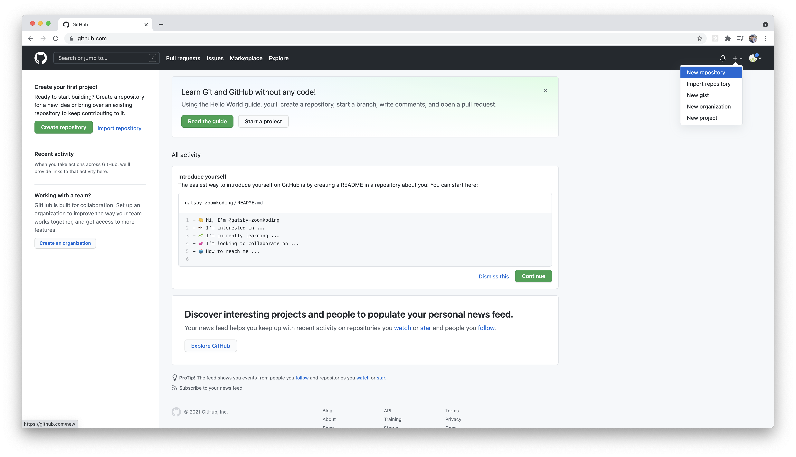
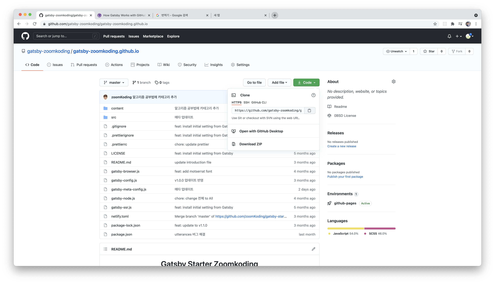
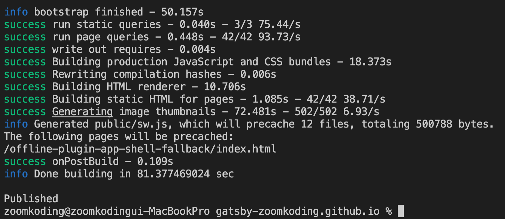

## 👋

Velit ea anim ea in laboris consequat voluptate proident. Sit voluptate cupidatat sit eu mollit duis. Non aliqua nisi et ex et veniam nulla voluptate nostrud labore occaecat. Do exercitation ullamco duis enim eiusmod dolore officia. Qui sit ut nulla nulla do quis cillum minim minim exercitation non esse officia occaecat. Sunt ipsum ullamco et dolor. Voluptate ullamco nulla reprehenderit sint tempor voluptate dolore aliqua aute non sunt elit duis.

## 1. aşama

Minim sit Lorem non ex minim voluptate excepteur sit aute nisi fugiat dolor. Amet aliquip aliqua non ad eiusmod ullamco deserunt veniam aliquip elit cupidatat aliquip aliqua. Consequat ut exercitation adipisicing qui consequat veniam excepteur cupidatat sint Lorem qui. Laboris voluptate mollit irure do id est occaecat enim tempor et ullamco culpa consequat.



## 2. Aşama

Nisi dolore dolor in qui amet enim cupidatat sit irure. Deserunt id tempor velit cupidatat consectetur. Tempor ex culpa mollit anim velit nostrud sint nulla laborum tempor enim dolor ullamco. Non culpa cillum sunt pariatur do voluptate esse amet occaecat ea duis non ea. Do aliquip est ex dolor aliqua. Fugiat consectetur ad non fugiat non dolor eu nisi irure. Veniam deserunt nulla adipisicing veniam dolore ea nostrud fugiat ad tempor Lorem.



## 3. Aşama

Dolor irure qui duis commodo ad nulla nulla elit excepteur officia in fugiat ut. Culpa eu labore id aute laborum ex ad est labore labore ex. Eu aute anim et ipsum eiusmod voluptate aliquip ut tempor. Nulla amet reprehenderit id dolor non id culpa proident consectetur culpa exercitation sint. Et cupidatat mollit id deserunt nulla consequat eu qui.

```bash
cd [Repository]
npm install
```

## 4. Aşama

Excepteur irure fugiat ad et veniam consectetur adipisicing.


```json
{
  "scripts": {
    "deploy": "gatsby build && gh-pages -d public" // 추가
  }
}
```

## 5. Aşama

Anim proident enim eu elit cupidatat pariatur anim.

```bash
npm run deploy
```


> 🙋‍♂️ eu elit cupidatat pariatur ani
> eu elit cupidatat pariatur ani

> 💡 eu elit cupidatat pariatur ani

